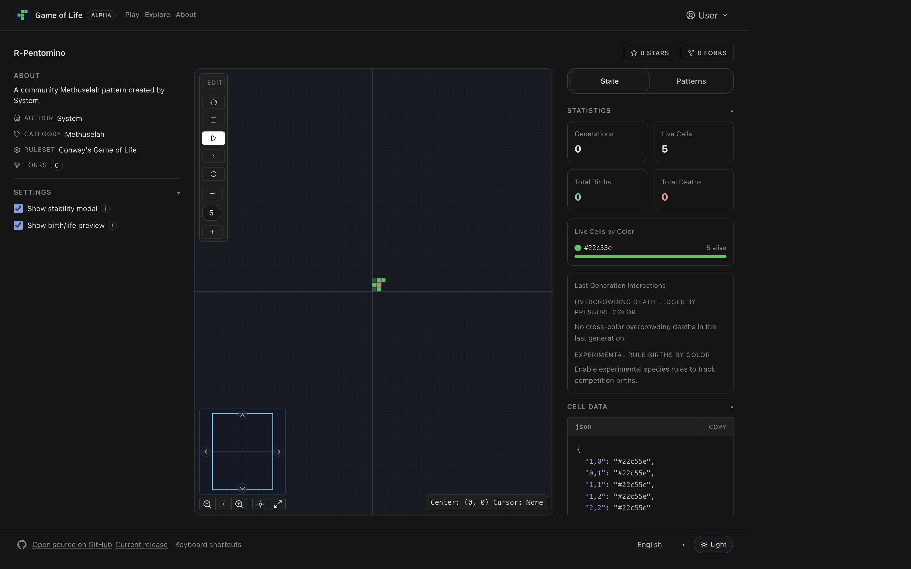
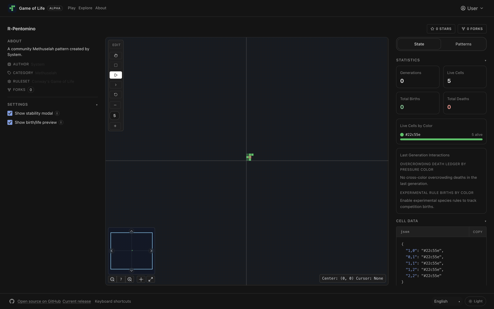
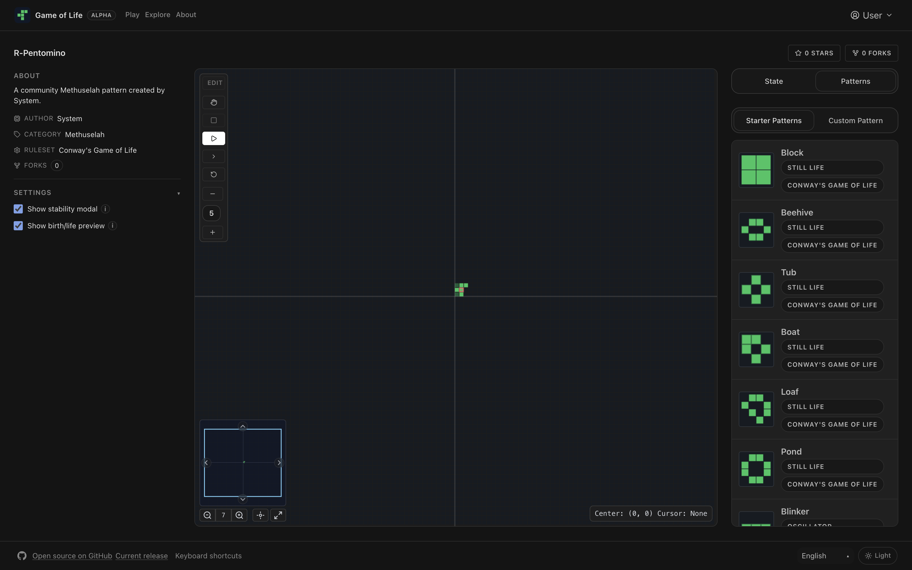
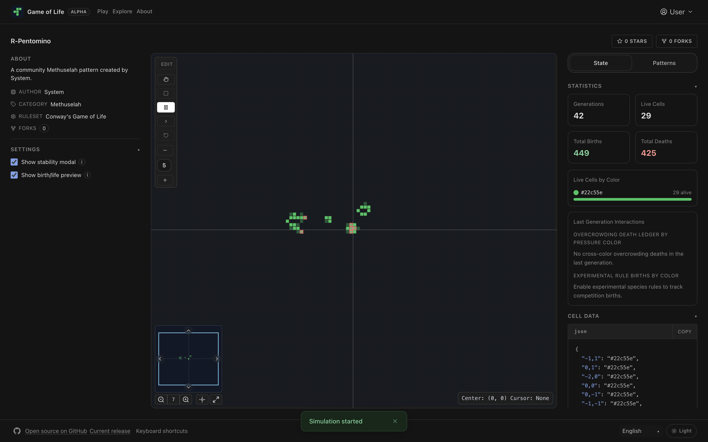

Conway's Game of Life
-----

[](https://github.com/wintermuted/game-of-life/actions/workflows/run-tests.yml)

This project is an implementation of [Conway's Game of Life](https://en.wikipedia.org/wiki/Conway%27s_Game_of_Life) written in [Typescript](https://www.typescriptlang.org/).

## Goals
- Provide a succinct example of my programming skill in TypeScript vis-a-vis a known programming problem.
- Demonstrate my understanding of [Big O notation](https://en.wikipedia.org/wiki/Big_O_notation).
- Provide myself an opportunity to learn HTML5 Canvas.

## Current State

### Key Features (Current Branch)

- Core simulation is implemented and tested in `@game-of-life/core`, with the main rules engine in [`packages/core/src/core/game.ts`](https://github.com/wintermuted/game-of-life/blob/master/packages/core/src/core/game.ts).
- Board state now uses a colored-cell model (per-cell color values instead of booleans), while preserving Conway-style life/death behavior.
- Edit mode now supports draw tools (pencil + eraser) and active draw-color selection.
- Experimental species competition rules are supported:
  - dominant-species birth rule
  - optional tie-break birth rule for tied parent colors
- Alternative Life-like rulesets are supported out of the box:
  - Conway (B3/S23)
  - HighLife (B36/S23)
  - Day & Night (B3678/S34678)
  - Life without Death (B3/S012345678)
- Pattern library and selector include ruleset-aware presets, including still lifes, oscillators, spaceships, guns, methuselahs, and alternative-rules seeds.
- Pattern metadata now includes richer descriptions and reference links surfaced in the Play UI.
- URL state/storage paths were updated for the colored model while maintaining compatibility with older board URLs where possible.
- Play UI includes simulation controls, minimap/viewport controls, diagnostics, and pattern workflows on top of the core engine.

### Screenshots

- Play view (dark state)

  

- Play view (state/diagnostics)

  

- Pattern selector with ruleset-aware presets

  

- Running simulation view

  

## Architecture

This project is organized as an **NX monorepo** with TypeScript composite builds:

### Canonical App Path

- The canonical UI app is `packages/app/src/`.
- The historical top-level `src/` tree has been removed.
- Use root scripts (`npm run dev`, `npm run build`, `npm test`) or Nx targets so commands resolve to `@game-of-life/app`.

### Packages

- **`@game-of-life/core`** (`packages/core/`) - Core game logic library
  - Pure TypeScript implementation of Conway's Game of Life rules
  - Game state management (Grid class)
  - Pattern definitions (oscillators, still lifes, spaceships, methuselahs)
  - Type definitions and interfaces
  - No dependencies on UI frameworks
  
- **`@game-of-life/app`** (`packages/app/`) - React UI application
  - Vite-based React application
  - Wintermuted UI theme components
  - Canvas-based grid rendering
  - Pattern selector and game controls
  - Depends on `@game-of-life/core`

### TypeScript Composite Builds

The project uses TypeScript's [project references](https://www.typescriptlang.org/docs/handbook/project-references.html) for incremental builds:

- Root `tsconfig.json` references both packages
- `packages/core/tsconfig.json` has `composite: true` and outputs to `dist/`
- `packages/app/tsconfig.json` references the core package

This enables:
- Faster incremental builds
- Better IDE performance
- Clear dependency boundaries between packages

## Technology

- **Build System**: [NX](https://nx.dev) - Smart monorepo build system with caching
- **Language**: TypeScript 5.0
- **UI Framework**: React 18 with Vite
- **UI Components**: [@wintermuted/ui-theme](https://github.com/wintermuted/ui-theme)
- **Testing**: Vitest
- **Bundler**: Vite

## Development

### Prerequisites

```bash
npm install
```

### Available Commands

```bash
# Development
npm run dev          # Start development server
npm start            # Alias for dev

# Building
npm run build        # Build all packages
npm run build:app    # Build only the app package

# Testing
npm test             # Run tests for all packages
npm run test:watch   # Run tests in watch mode
npm run test:ui      # Open Vitest UI

# Linting
npm run lint         # Lint the app package

# Preview
npm run preview      # Preview production build
```

### NX Commands

You can also use NX directly for more control:

```bash
# Run tasks for specific packages
npx nx run @game-of-life/core:build
npx nx run @game-of-life/core:test
npx nx run @game-of-life/app:dev

# Run tasks for all packages
npx nx run-many --target=test --all
npx nx run-many --target=build --all

# View project graph
npx nx graph
```

### Package Structure

```
game-of-life/
├── packages/
│   ├── core/                 # Core game logic library
│   │   ├── src/
│   │   │   ├── core/        # Game rules and calculations
│   │   │   ├── class/       # Game class
│   │   │   ├── data/        # Pattern definitions
│   │   │   ├── interfaces/  # TypeScript types
│   │   │   └── index.ts     # Public API
│   │   ├── dist/            # Compiled output
│   │   ├── package.json
│   │   └── tsconfig.json
│   └── app/                  # React UI application
│       ├── src/
│       │   ├── app/         # React components
│       │   ├── index.tsx    # Entry point
│       │   └── ...
│       ├── public/
│       ├── package.json
│       ├── tsconfig.json
│       └── vite.config.ts
├── package.json              # Root package.json (workspace)
├── tsconfig.json            # Root TypeScript config (project references)
└── nx.json                  # NX workspace configuration
```

## Deployment

This project is automatically deployed to GitHub Pages using GitHub Actions:

- **Production Deployment**: Automatically deployed to GitHub Pages when changes are merged to the `main` or `master` branch.
  - 🌐 **Live Site**: https://wintermuted.github.io/game-of-life/
- **PR Previews**: Each pull request receives a preview deployment which is automatically cleaned up when the PR is closed. The preview URL is posted as a comment on the PR.

The deployment workflows are located in `.github/workflows/`:
- `deploy-pages.yml` - Main production deployment
- `deploy-pr-preview.yml` - PR preview deployments
- `cleanup-pr-preview.yml` - PR preview cleanup
